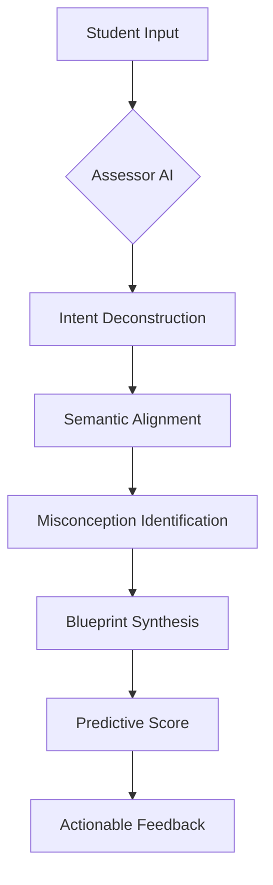

#  AQMD: Advanced Cognitive Engine V2.0

<p align="center">
  
  
  
  
</p>

### **Predictive Grading. Career Launch.**
AQMD isn't just a study tool—it's a **Cognitive Alignment Engine** designed to bridge the gap between academic preparation and real-world career demand. By mapping your syllabus directly to industry requirements, AQMD finds the papers you need to master and grades your performance with institutional-grade precision.

---

## ⚡ Cognitive Intelligence Lifecycle
The core of AQMD is its proprietary analysis flow, ensuring every answer is evaluated for more than just correctness.



1.  **📡 Secure Uplink**: Establishing encrypted connection to the Assessor AI.
2.  **🔍 Intent Deconstruction**: Deep-parsing the teacher's target pedagogical goal.
3.  **🧠 Semantic Alignment**: Evaluating student responses for conceptual density and accuracy.
4.  **✨ Misconception Identification**: Pinpointing precise gaps in understanding.
5.  **📊 Blueprint Synthesis**: Generating actionable feedback and improvement pathways.


---

## 🚀 Key Modules

### **1. The Diagnostic Terminal**
A high-performance interface for real-time answer evaluation.
- **Predictive Scoring**: Immediate feedback on semantic alignment.
- **Intent Deviation Mapping**: Understand exactly *where* your answer drifted from the goal.
- **Dynamic Reframe Suggestions**: AI-generated prompts to help you improve your responses.

### **2. Predictive Score Tracking**
Track your journey toward exam readiness with automated mastery metrics.
- **Mastery Goal Visualization**: Data-driven progress bars tracking your path to 95% proficiency.
- **Exam Readiness Index**: Real-time calculation of your likelihood to excel in upcoming tests.

### **3. The Question Vault & Syllabus Archives**
Access a curated repository of past papers and institutional knowledge.
- **Industry Relevance Mapping**: See why a specific question matters for your future career.
- **Learning Blueprints**: Automatically generated study maps based on your history and uploads.

### **4. Mobile-First Architecture**
Full Capacitor integration allows AQMD to live where you study.
- **Native Android Support**: Sync assets and run as a high-performance native app.
- **Cross-Platform Sync**: Your progress follows you from desktop to mobile.

---

## ✨ Immersive Experience
AQMD is designed for focus. The interface features:
- **Liquid Motion**: Powered by `Framer Motion` for silky-smooth transitions and haptic-like feedback.
- **Blueprint Aesthetic**: A technical, dark-mode first design that reduces eye strain during long study sessions.
- **Real-time Diagnostic Feedback**: Watch the AI deconstruct your answer line-by-line in the loading terminal.

---

## 📊 System Monitoring
| Component | Status | Utility |
| :--- | :--- | :--- |
| **Cognitive Engine** |  | Llama-3 Analysis |
| **Question Vault** |  | Past Paper Access |
| **Mobile Sync** |  | Android Integration |


---

## 🛠 Tech Stack

| Layer | Technologies |
| :--- | :--- |
| **Frontend** | [Next.js](https://nextjs.org/), [Framer Motion](https://www.framer.com/motion/), [Tailwind CSS](https://tailwindcss.com/) |
| **Intelligence** | [Llama-3.3-70B](https://groq.com/), [Groq SDK](https://github.com/groq/groq-typescript) |
| **Backend** | [Prisma ORM](https://www.prisma.io/), [PostgreSQL](https://www.postgresql.org/) |
| **Mobile** | [Capacitor](https://capacitorjs.com/), [Android SDK](https://developer.android.com/) |
| **UI Components** | [Radix UI](https://www.radix-ui.com/), [Lucide Icons](https://lucide.dev/) |

---

## 🏃 Getting Started

### 1. Initialize the Engine
```bash
npm install
```

### 2. Configure Intelligence
Create a `.env` file with your credentials:
```env
DATABASE_URL="your_postgresql_url"
GROQ_API_KEY="your_groq_api_key"
```

### 3. Deploy Local Environment
```bash
npm run dev
```

### 4. Sync for Mobile
```bash
npm run mobile:sync
```

---

## 🌐 Vision & Origin

AQMD is built for high-performance learners who demand more from their study materials. It's designed to turn passive reading into active mastery.

<p align="center">
  <b>Built with ❤️ for the future of education in India 🇮🇳</b><br/>
  
</p>

---

<p align="center">
  <a href="#top">Back to Top</a>
</p>
