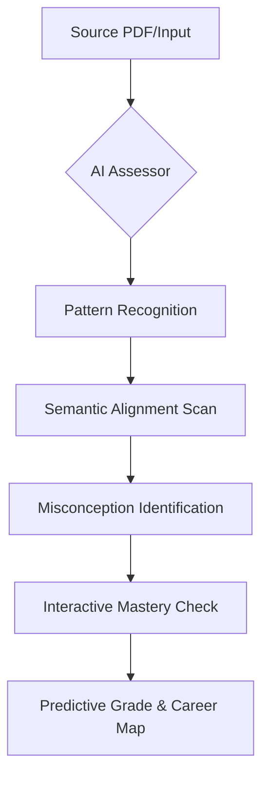

#  AQMD: Advanced Cognitive Engine V2.0

  
  
  

### **Turning Passive Reading into Active Mastery.**

## 🛠 Technical Architecture

| Layer | Technology | Purpose |
| :--- | :--- | :--- |
| **Framework** | [Next.js 15+](https://nextjs.org/) | Full-stack architecture with App Router & Server Actions. |
| **Intelligence** | [Groq (Llama-3.3-70B)](https://groq.com/) | High-speed semantic analysis and pedagogic evaluation. |
| **OCR Processing** | [OCR.space API](https://ocr.space/) | Extracting text from scanned PDFs and handwritten notes. |
| **Data Persistence** | [Prisma ORM](https://www.prisma.io/) + [PostgreSQL](https://www.postgresql.org/) | Type-safe database management and relational storage. |
| **Mobile Bridge** | [Capacitor 8.0](https://capacitorjs.com/) | Native Android integration with custom share-intent handling. |
| **Styling** | [Tailwind CSS 4.0](https://tailwindcss.com/) | Utility-first design with high-performance dark-mode tokens. |
| **Animations** | [Framer Motion](https://www.framer.com/motion/) | Liquid transitions and interactive UI state management. |
| **UI Primitive** | [Radix UI](https://www.radix-ui.com/) | Accessible, unstyled components for building custom UI kits. |
| **Icons** | [Lucide React](https://lucide.dev/) | Consistent, lightweight vector iconography. |

---
AQMD is a high-performance **Cognitive Alignment Platform** designed for students and educators who demand precision. It bridges the gap between study materials and real-world exam performance through institutional-grade AI analysis.

---

## 💎 Core Product Ecosystem

### **1. Smart PDF Study Companion**
The crown jewel of AQMD. Don't just read—engage.
- **Context-Aware Learning**: Upload any PDF (textbook, research paper, or notes) and the engine tracks your reading progress page-by-page.
- **Deep OCR Integration**: The system automatically deconstructs scanned documents into actionable text in real-time.
- **AI-Powered Reflection**: After every page, AQMD generates:
  - **Compressed Summaries**: Fast recall of core technical concepts.
  - **Critical Reflection Questions**: Interactive challenges to test your deep understanding.
  - **Study Tips**: Behavioral nudges to improve retention.
- **"I'm Stuck" Engine**: If you encounter a complex concept, trigger the AI Assistant for an immediate, simplified breakdown tailored to that specific page.

### **2. The Diagnostic Terminal**
A high-stakes interface for semantic alignment check and pattern recognition.
- **Answer Validation**: AQMD evaluates the **Alignment Score** between teacher intent and student output.
- **Question Evolution Timeline**: 5-year deep-analysis of exam patterns (MCQ vs Theory) with predictive modeling for 2025.
- **Important Questions Predictor**: AI-identified "Sure-Shot" questions and predicted "Never Asked Before" challenges.
- **Chapter Weightage**: Data-driven mapping of syllabus chapters to their respective marks distribution and importance.

### **3. Career Impact Engine**
AQMD bridges the gap between grades and high-paying jobs.
- **Market Demand Scan**: See the real-world demand percentage for any subject or concept.
- **Top Roles & Hiring Companies**: Direct mapping of syllabus topics to the companies hiring for those skills (e.g., Google, Microsoft, Amazon).
- **Industry Resilience Index**: Predicts how a specific concept translates to long-term career stability.

### **4. Predictive Mastery Hub**
Data-driven transparency into your academic journey.
- **Exams Readiness Score**: Real-time calculation of your proficiency across all attempted papers.
- **Syllabus Archives (History)**: Full retrospective of your past diagnostic records and improvement curve.
- **Learning Blueprints (Pathways)**: Automatically generated study maps based on your historical performance.
- **Live Ecosystem Stats**: Real-time engagement tracking of the high-performance student community in India.

### **5. Mobile-Native Power**
AQMD isn't just a website; it's a mobile performance companion.
- **Native Android Experience**: Smooth, high-performance interface built with Capacitor 8.0.
- **System-Level Share Support**: Share any PDF from your browser or file manager directly to AQMD to start a session.
- **Cross-Device Sync**: Your study progress and history stay with you across all devices.

---

## 🔒 Privacy & Data Sovereignty
We understand the sensitivity of academic materials. AQMD is built with a **Privacy-First Architecture**:
- **Local PDF Processing**: Your PDFs are stored in your browser's `localStorage`. They **never** upload to our servers.
- **Metadata-Only Analysis**: Only extracted text snippets are sent to the Assessor AI for pedagogical evaluation.
- **Anonymous Identity**: No complex signup required—guest identities ensure your data belongs only to you.

---

## ⚡ The Intelligence Lifecycle
AQMD's proprietary analysis flow ensures precision in every interaction.

---

## ✨ Immersive Design Philosophy
We believe study tools should feel like high-end engineering software.
- **Liquid Motion**: Silky-smooth transitions powered by `Framer Motion`.
- **Next.js 15+ Resilience**: Built on the bleeding edge of web technology for sub-second response times.
- **Blueprint Aesthetic**: A technical, dark-mode focused UI designed to minimize cognitive load during deep work.

---

## 🌐 Vision & Origin

AQMD (Advanced Quality Mastery & Diagnostics) is built for the next generation of Indian technical leaders. It transforms "reading" into "quantified mastery."

  <b>Built for high-performance learners in India 🇮🇳</b> 
  

---

  <a href="#top">Back to Top</a>

